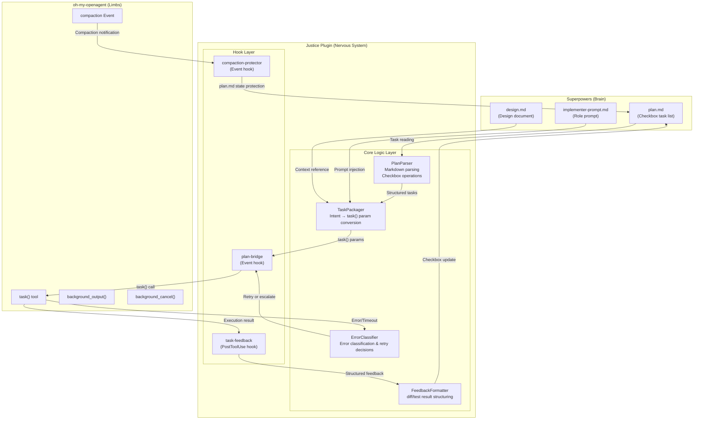

# Justice Plugin — Design Document

> **Date**: 2026-03-24
> **Status**: Approved
> **Author**: y_ohi + AI Architect

## Overview

Justice is an OpenCode plugin that acts as the "nervous system" connecting
Superpowers (the brain / project manager) with oh-my-openagent (the limbs /
powerful execution engine). It translates Superpowers' declarative intent
(Markdown files) into oh-my-openagent's event-driven API.

## Architecture

### Approach: Hook-First

All plugin functionality is implemented as individual OmO hooks, with pure
business logic extracted into a core layer for testability.

| Layer | Responsibility | Test Strategy |
|-------|---------------|---------------|
| **Hook Layer** | Catch OmO lifecycle events, delegate to core logic | Integration tests (mocked OmO hook API) |
| **Core Logic Layer** | Pure business logic, no OmO dependency | Unit tests (100% coverage target) |

### Architecture Diagram



## Core Data Models

### Plan Task Structure

```typescript
interface PlanTask {
  id: string;
  title: string;
  steps: PlanStep[];
  status: "pending" | "in_progress" | "completed" | "failed";
}

interface PlanStep {
  id: string;
  description: string;
  checked: boolean;
  lineNumber: number;
}
```

### Delegation Request

```typescript
interface DelegationRequest {
  category: TaskCategory;
  prompt: string;
  loadSkills: string[];
  runInBackground: boolean;
  context: DelegationContext;
}

interface DelegationContext {
  planFilePath: string;
  taskId: string;
  referenceFiles: string[];
  rolePrompt?: string;
  previousLearnings?: string;
}
```

### Task Feedback

```typescript
interface TaskFeedback {
  taskId: string;
  status: "success" | "failure" | "timeout" | "compaction_risk";
  diff?: string;
  testResults?: TestSummary;
  unresolvedIssues?: string[];
  retryCount: number;
  errorClassification?: ErrorClass;
}

interface TestSummary {
  passed: number;
  failed: number;
  skipped: number;
  failureDetails?: string[];
}
```

### Error Classification

```typescript
type ErrorClass =
  | "syntax_error"
  | "type_error"
  | "test_failure"
  | "design_error"
  | "timeout"
  | "loop_detected"
  | "unknown";
```

### Protected Context (Compaction)

```typescript
interface ProtectedContext {
  planSnapshot: string;
  currentTaskId: string;
  currentStepId: string;
  accumulatedLearnings: string;
  timestamp: string;
}
```

## Hook Designs

### Hook 1: plan-bridge (Task Delegation Bridge)

- **Events**: Message, PreToolUse
- **Trigger**: Agent message references plan.md or contains delegation keywords
- **Flow**:
  1. Parse plan.md → identify incomplete tasks
  2. Collect task context (reference files, role prompt)
  3. Convert via TaskPackager to task() parameters
  4. Call task() (optionally with background=true)

### Hook 2: compaction-protector (Compaction Protection)

- **Events**: Event (compaction)
- **Trigger**: OmO compaction or preemptive-compaction event fires
- **Flow**:
  1. Snapshot current plan.md state
  2. Record active task/step IDs
  3. Serialize accumulated learnings
  4. Re-inject as ProtectedContext after compaction

### Hook 3: task-feedback (Feedback Loop) — Phase 2+

- **Events**: PostToolUse (after task())
- **Flow**:
  1. Extract diff/test results from task() response
  2. Structure via FeedbackFormatter
  3. Classify via ErrorClassifier
  4. Branch on result:
     - Success → update plan.md checkbox ✅
     - Layer 1 error → log only (OmO auto-fix)
     - Layer 2 error → append error note to plan.md, inject re-planning message
     - Timeout → inject task split instruction

## Error Handling

### Layered Error Handling

| Error Type | Max Retries | Escalation |
|-----------|------------|------------|
| syntax_error | 3 | Layer 2 |
| type_error | 3 | Layer 2 |
| test_failure | 0 | Immediate Layer 2 |
| design_error | 0 | Immediate Layer 2 |
| timeout | 0 | Immediate abort |
| loop_detected | 0 | Immediate abort |

### Layer 1 (OmO Auto-Fix)

Simple syntax/type errors are handled transparently by OmO's auto-correction
loop (Sisyphus). Justice does not intervene.

### Layer 2 (Superpowers Escalation)

Retry limit reached or fundamental design errors. Execution is halted.
Failed test output and recent fix attempt history are returned as a summary,
prompting re-planning via systematic-debugging or brainstorming.

### Timeout/Loop Detection

Catches loop-detector or timeout events and force-terminates the task.
Notifies: "Task was interrupted because it was too complex or entered an
infinite loop" with meta-instruction: "Split the task into smaller steps
and update plan.md."

## Tech Stack

- **Language**: TypeScript
- **Runtime**: Node.js
- **Package Manager**: bun
- **Test Framework**: Vitest
- **Linting**: ESLint + Prettier
- **Dev Environment**: Devcontainer (Node 22 + bun)

## Directory Structure

```
justice/
├── .devcontainer/
│   ├── devcontainer.json
│   └── Dockerfile
├── src/
│   ├── core/
│   │   ├── types.ts
│   │   ├── plan-parser.ts
│   │   ├── task-packager.ts
│   │   ├── feedback-formatter.ts
│   │   └── error-classifier.ts
│   ├── hooks/
│   │   ├── plan-bridge.ts
│   │   ├── compaction-protector.ts
│   │   └── task-feedback.ts
│   └── index.ts
├── tests/
│   ├── core/
│   │   ├── plan-parser.test.ts
│   │   ├── task-packager.test.ts
│   │   ├── feedback-formatter.test.ts
│   │   └── error-classifier.test.ts
│   ├── hooks/
│   │   ├── plan-bridge.test.ts
│   │   ├── compaction-protector.test.ts
│   │   └── task-feedback.test.ts
│   └── fixtures/
│       ├── sample-plan.md
│       ├── sample-plan-partial.md
│       └── sample-design.md
├── docs/
│   └── plans/
├── package.json
├── tsconfig.json
├── vitest.config.ts
├── .eslintrc.json
├── .prettierrc
├── README.md
└── AGENTS.md
```

## OmO Integration

Plugin installs as `.opencode/skills/justice/SKILL.md` with hooks registered
in `oh-my-opencode.jsonc`:

```jsonc
{
  "hooks": {
    "custom": [
      {
        "name": "justice-plan-bridge",
        "event": ["Message", "PreToolUse"],
        "source": "./node_modules/justice-plugin/dist/hooks/plan-bridge.js"
      },
      {
        "name": "justice-compaction-protector",
        "event": ["Event"],
        "source": "./node_modules/justice-plugin/dist/hooks/compaction-protector.js"
      }
    ]
  }
}
```

## Roadmap

### Phase 1 — Foundation (Current Scope)

- Project scaffolding: Devcontainer, package.json, tsconfig, Vitest, ESLint
- Core logic: types.ts, plan-parser.ts, task-packager.ts, error-classifier.ts
- Compaction protection: compaction-protector.ts hook
- Tests: Unit tests for all core logic + test fixtures

### Phase 2 — Task Delegation Bridge (Current Scope)

- Bridge hook: plan-bridge.ts (Message + PreToolUse)
- Integration tests with mocked OmO API

### Phase 3 — Feedback Loop (Current Scope)

- Feedback: feedback-formatter.ts, task-feedback.ts
- plan.md auto-update: checkbox ON/OFF + error note appending

### Phase 4 — Advanced Error Handling (Future)

- Loop detection integration with OmO's loop-detector event
- Timeout control linked to staleTimeoutMs configuration
- Smart retry with exponential backoff and context-shrinking retry
- Auto-generation of split instructions for failed tasks

### Phase 5 — Wisdom Integration (Future)

- Bidirectional sync with OmO's .sisyphus/notepads/ system
- Learning persistence: feed learnings/decisions/gotchas back to design.md
- Pattern library: template successful patterns for improved first-pass success

### Phase 6 — Multi-Agent Coordination (Future)

- Parallel task delegation by analyzing plan.md dependency graphs
- Auto category selection based on semantic analysis of task content
- Agent handoff integration with /handoff command
- Progress dashboard as an MCP server for real-time plan.md visualization

### Phase 7 — Ecosystem Expansion (Future)

- CLI: `justice init`, `justice status`, `justice retry <task-id>`
- VSCode extension: progress bar, gutter status, one-click delegation
- Prometheus integration: auto-convert Prometheus-generated plans to Justice format
- Claude Code compatibility: installable via settings.json hook format
- Custom skill SDK: plugin API for user-defined bridge logic
